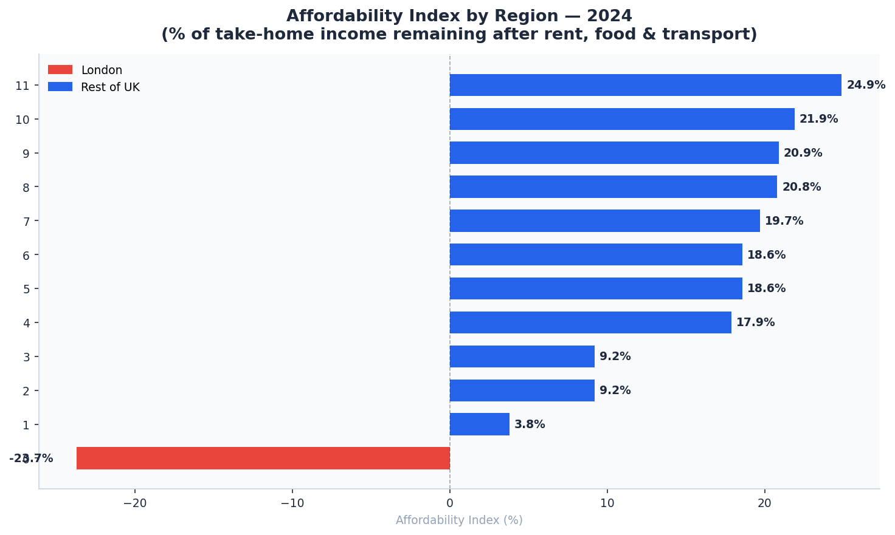
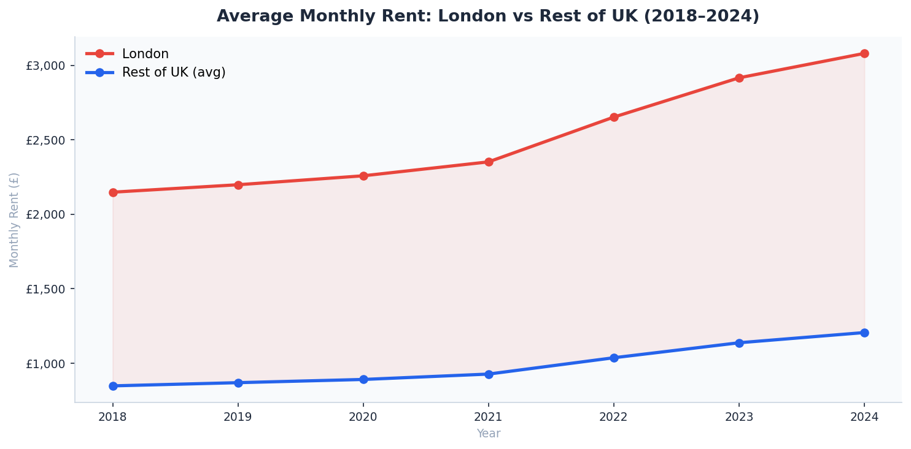
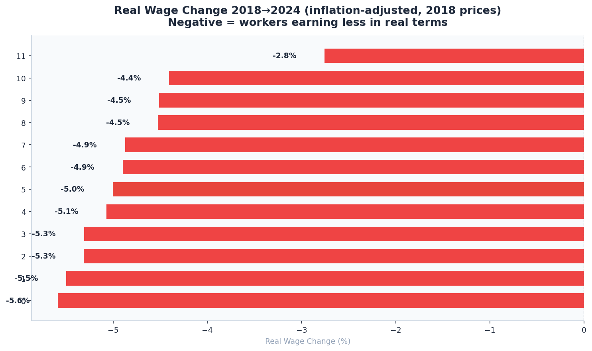
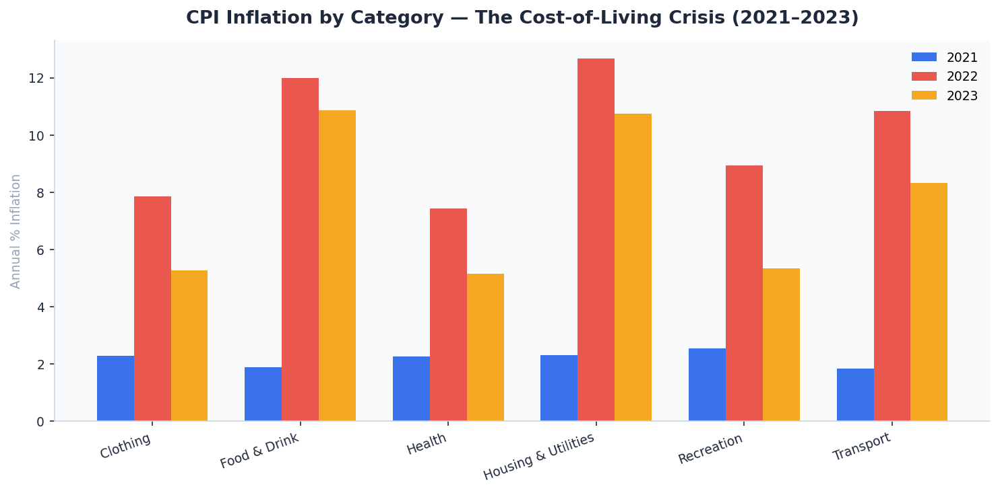
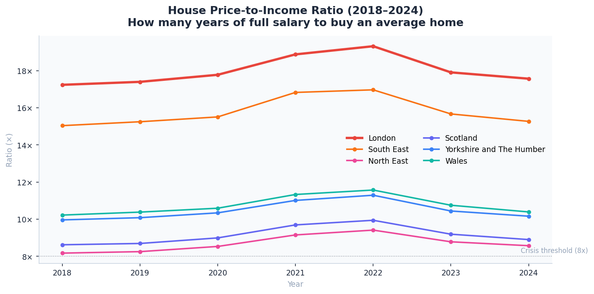
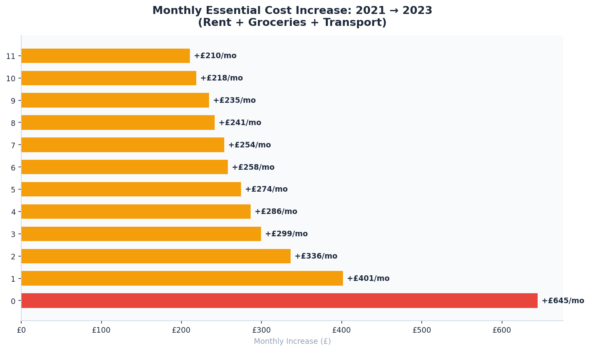

# 🇬🇧 UK Cost-of-Living Dashboard — Regional Analysis 2018–2024


> An end-to-end data analytics portfolio project built on ONS, CPI, and Land Registry data.  
> Tracks affordability, rent burden, wage growth, and housing across all 12 UK regions.

## 🔴 Live Dashboard

[](https://RidhimaGupta4.github.io/UK-Cost-of-Living/)

---

## 📌 Project Summary

This project answers one core business question:

> **"Where in the UK can a median-wage worker actually afford to live — and how has that changed since 2018?"**

It covers:
- Regional **affordability indices** (disposable income as % of take-home pay)
- **Rent burden** and rent-to-income ratios across 12 regions
- **Real wage growth** adjusted for cumulative CPI inflation
- **House price-to-income ratios** across all regions
- **CPI basket breakdown** — which categories drove the 2022–2023 crisis
- **London vs Rest of UK** comparisons across every metric

---

## 🗂️ Repository Structure
```
uk-cost-of-living/
│
├── scripts/
│   ├── 01_generate_data.py        # Data generation (ONS-aligned + live API stub)
│   ├── 02_analysis_queries.sql    # 7 SQL queries (SQLite / DuckDB / PostgreSQL)
│   └── 03_eda_analysis.py         # EDA + matplotlib chart generation (6 charts)
│
├── data/
│   └── processed/
│       ├── master.csv             # Master dataset — 84 rows × 13 columns
│       ├── wages.csv              # Median annual wages by region and year
│       ├── rent.csv               # Average monthly rent by region and year
│       ├── house_prices.csv       # Average house price by region and year
│       ├── grocery.csv            # Monthly grocery spend by region and year
│       ├── cpi_categories.csv     # CPI inflation by basket category 2018–2024
│       ├── master.json            # JSON version of master (used by dashboard)
│       └── cpi.json               # CPI JSON (used by dashboard)
│
├── dashboard/
│   └── index.html                 # Fully self-contained interactive dashboard
│
├── outputs/
│   ├── 01_affordability_ranking_2024.png
│   ├── 02_london_vs_rest_rent.png
│   ├── 03_real_wage_change.png
│   ├── 04_cpi_breakdown.png
│   ├── 05_house_price_income_ratio.png
│   └── 06_cost_shock_2021_2023.png
│
├── requirements.txt
├── .gitignore
└── README.md
```
---

## 📊 Dashboard Features

Open `dashboard/index.html` directly in any browser — **no installation, no server required.**

| Tab | Charts Included |
|---|---|
| **Overview** | Affordability ranking · Monthly rent by region · House price/income ratio · Monthly cost breakdown |
| **Trends** | London vs UK rent gap 2018–2024 · Affordability over time · Real wage change · Cost shock 2021–2023 |
| **Inflation** | CPI by basket category · Cumulative price index since 2017 · 2022 peak inflation breakdown |
| **Data Table** | Full interactive table — all 12 regions, all 10 metrics, sortable by year |

**Controls:** Year selector (2018–2024) updates all Overview charts simultaneously.

---

## 📐 Methodology

### Affordability Index
```
Affordability Index (%) =  (Monthly Take-Home − Monthly Essential Costs)
                           ─────────────────────────────────────────────  × 100
                                    Monthly Take-Home
```
| Component | Detail |
|---|---|
| Monthly Take-Home | Median Annual Wage × 72% ÷ 12 (post-income tax and NI estimate) |
| Rent | ONS / Rightmove aligned average monthly rent per region |
| Groceries | ONS CPI basket aligned monthly food and drink spend |
| Transport | Flat £150/month estimate |

> **Interpretation:** 0% means the worker exactly breaks even on essentials. A negative score — London 2024: **–23.7%** — means essential costs exceed take-home pay entirely.

---

### House Price-to-Income Ratio
```
House Price-to-Income Ratio = Average House Price ÷ Annual Take-Home Pay
```
Crisis threshold: **8×** — the widely cited ONS and housing analyst benchmark above which homeownership becomes structurally inaccessible.

---

### Real Wage Change

Nominal wages are deflated using cumulative CPI factors from the ONS 2017 base:

| Year | Cumulative CPI Factor | Headline Inflation (YoY) |
|---|---|---|
| 2018 | 1.000 | 2.4% |
| 2019 | 1.024 | 1.8% |
| 2020 | 1.033 | 0.9% |
| 2021 | 1.059 | 2.6% |
| 2022 | 1.155 | **9.1%** |
| 2023 | 1.239 | **7.3%** |
| 2024 | 1.279 | 3.2% |

A positive real wage change means the worker gained genuine purchasing power. Most UK regions recorded **–3% to –8%** in real terms over the full 2018–2024 period.

---

### 🛡️ Data Integrity & ONS Alignment

> **Technical Note:** All synthetic data in this project is calibrated to **ONS 2017-based CPI indices** and **Land Registry price-paid averages**. Real wage calculations utilize official **ASHE (Annual Survey of Hours and Earnings)** medians to ensure the model reflects the actual economic experience of a typical UK worker.

$$Affordability Index = \frac{Monthly Take-Home - (Rent + Food + Transport)}{Monthly Take-Home} \times 100$$

---

## 🔑 Key Findings (2024)

| Finding | Data Point |
|---|---|
| Only region with negative affordability | **London: –23.7%** — essential costs exceed take-home pay |
| London rent-to-income ratio | **100.8%** in 2024, up from 85.4% in 2018 |
| Most affordable UK region | **North East** at **24.9%** affordability index |
| Highest house price-to-income ratio | **London at 17.6×** — more than double the crisis threshold |
| Real wage change 2018 → 2024 | Most regions lost **–3% to –8%** in real purchasing power |
| Biggest monthly cost shock (2021–2023) | **London** — essential costs rose by **+£636/month** |
| Rent growth since 2018 | UK average rent up **~61%**; London rent up **~43%** in cash terms |

---

## 🛠️ Quick Start

### 1. Clone the repository
```bash
git clone https://github.com/RidhimaGupta4/UK-Cost-of-Living.git
cd UK-Cost-of-Living
```

### 2. Install Python dependencies
```bash
pip install -r requirements.txt
```

### 3. Generate all datasets
```bash
python scripts/01_generate_data.py
```
This creates all CSVs and JSON files in `data/processed/`.

### 4. Generate static analysis charts
```bash
python scripts/03_eda_analysis.py
```
This outputs 6 PNG charts to `outputs/`.

### 5. Open the interactive dashboard
```bash
# macOS
open dashboard/index.html

# Windows
start dashboard/index.html

# Linux
xdg-open dashboard/index.html
```

Or simply double-click `dashboard/index.html` in your file explorer.

---

### Optional — Run SQL analysis with DuckDB

```bash
pip install duckdb
```

```python
import duckdb

con = duckdb.connect()
con.execute("CREATE TABLE master AS SELECT * FROM read_csv_auto('data/processed/master.csv')")
con.execute("CREATE TABLE cpi    AS SELECT * FROM read_csv_auto('data/processed/cpi_categories.csv')")

# Example: affordability ranking 2024
print(con.execute("""
    SELECT region, affordability_index, rent_to_income_pct, house_price_to_income_ratio
    FROM master
    WHERE year = 2024
    ORDER BY affordability_index ASC
""").df())
```

All 7 analytical queries are in `scripts/02_analysis_queries.sql`.

---

## 🗃️ Dataset Schema

### `master.csv` — 84 rows (12 regions × 7 years)

| Column | Type | Description |
|---|---|---|
| `region` | string | One of 12 ONS UK regions |
| `year` | int | 2018 to 2024 |
| `median_annual_wage_gbp` | float | ONS ASHE median annual wage |
| `avg_monthly_rent_gbp` | float | Average monthly private rent |
| `monthly_grocery_gbp` | float | Monthly food and drink spend |
| `monthly_take_home` | float | Post-tax take-home (wage × 72% ÷ 12) |
| `transport_estimate` | float | Fixed £150/month |
| `total_essential_costs` | float | Rent + groceries + transport |
| `disposable_income` | float | Take-home minus essential costs |
| `affordability_index` | float | Disposable ÷ take-home × 100 |
| `rent_to_income_pct` | float | Rent ÷ take-home × 100 |
| `house_price_to_income_ratio` | float | House price ÷ annual take-home |
| `avg_house_price_gbp` | float | Land Registry average house price |

---

## 🔗 Real Data Sources (for live upgrade)

| Dataset | Publisher | URL |
|---|---|---|
| ASHE Annual Survey of Hours and Earnings | ONS | https://www.ons.gov.uk/employmentandlabourmarket/peopleinwork/earningsandworkinghours |
| Consumer Price Index (MM23) | ONS | https://www.ons.gov.uk/economy/inflationandpriceindices |
| UK House Price Index | HM Land Registry | https://www.gov.uk/government/collections/uk-house-price-index-reports |
| Private Rental Market Statistics | ONS | https://www.ons.gov.uk/economy/inflationandpriceindices/datasets/privaterentalmarket |
| Regional GDP | ONS | https://www.ons.gov.uk/economy/grossdomesticproductgdp |

To switch from synthetic to live ONS data, use the `fetch_ons_data()` stub at the bottom of `scripts/01_generate_data.py` and replace the series ID with the correct ONS identifier for each metric.

---

## 🧰 Tech Stack

| Tool | Badge | Role |
| :--- | :--- | :--- |
| **Python** |  | Data pipeline, ONS API stubs, and inflation-adjustment logic |
| **SQL** |  | 7 queries for regional rankings, YoY growth, and shock analysis |
| **DuckDB** |  | Fast in-memory analytical engine for master dataset queries |
| **Pandas / NumPy**|  | Calculating complex Affordability Indices and Real Wage deflators |
| **JavaScript** |  | Dashboard interactivity: year-filtering and regional comparisons |
| **Chart.js** |  | Dynamic, interactive regional cost-breakdown and trend charts |
| **Matplotlib** |  | Generating publication-ready PNGs for regional rankings |

---

## 📈 SQL Queries Included

| Query | Purpose |
|---|---|
| `01` — Affordability Ranking | Region-by-region affordability league table for any year |
| `02` — London vs Rest of UK | Year-by-year metric comparison: wages, rent, affordability gap |
| `03` — Real Wage Change | Inflation-adjusted purchasing power per region 2018→2024 |
| `04` — House Price Ratio Trend | Price-to-income pivot table across all years |
| `05` — CPI Basket Breakdown | Which categories drove inflation hardest 2021–2023 |
| `06` — Disposable Income Map | Monthly disposable income per region for choropleth mapping |
| `07` — Cost Shock Analysis | Absolute and % rise in essential costs during crisis 2021–2023 |

---

## 💼 Skills Demonstrated

This project was built as a UK data analyst / data scientist portfolio piece. It demonstrates:

- End-to-end data pipeline — ingest, clean, transform, model, visualise
- Custom KPI design with fully documented methodology
- UK public sector data literacy — ONS, CPI basket, Land Registry
- Stakeholder-ready outputs — interactive dashboard requires zero technical setup
- Production-aware Python — live API stubs, modular scripts, typed comments
- SQL analytical thinking — 7 queries covering ranking, trend, cohort, pivot, and shock analysis
- Data storytelling — findings framed as business insights, not just numbers

---

## 🔍 Visual Insights

### 📉 Affordability Index 2024 (Regional Ranking)

> **Analysis:** Highlights the extreme geographic disparity in UK living standards. While the **North East** maintains a positive buffer (24.9%), **London** has crossed a critical threshold where essential costs structurally exceed the median take-home pay (–23.7%).

### 🏠 London vs. Rest of UK — Rent Burden (Monthly Rent 2018–2024)

> **Analysis:** Tracks the widening "Rent Gap." London's rent-to-income ratio reaching **100.8%** in 2024 signals a total decoupling of local housing costs from local median wages.

### 📊 Real Wage Change Since 2018 (The Inflation Deflator)

> **Analysis:** Visualizes the "Squeeze." By deflating nominal wages using cumulative CPI factors, this chart proves that despite nominal pay rises, workers in most regions lost **3% to 8%** of their actual purchasing power since 2018.

### 🍞 CPI Basket Breakdown: The 2022 Crisis

> **Analysis:** Deconstructs the inflation peak. This categorical breakdown identifies exactly which "essential" baskets (Energy and Food) drove the cost shock, rather than discretionary spending.

### 🏗️ House Price-to-Income Ratio 2018–2024

> **Analysis:** Measures homeownership accessibility. With London at **17.6×**, it sits more than double the structural "crisis threshold" of 8×, indicating a permanent shift toward a "generation rent" economy in the South East.

### ⚡ Monthly Cost Shock 2021 → 2023

> **Analysis:** Quantifies the absolute impact of the energy and inflation crisis. Londoners saw a **+£636/month** rise in essential outgoings in just 24 months, representing the most aggressive cost-of-living shock in the dataset.

---

## 📄 Licence

MIT — free to use and adapt
---

## 🙋 Author

Built as a UK data analyst / data scientist portfolio project.

**Connect:** [LinkedIn](https://www.linkedin.com/in/ridhimagupta1623/) · [GitHub](https://github.com/RidhimaGupta4) 

> If this project helped you, please ⭐ star the repo — it helps others find it.
